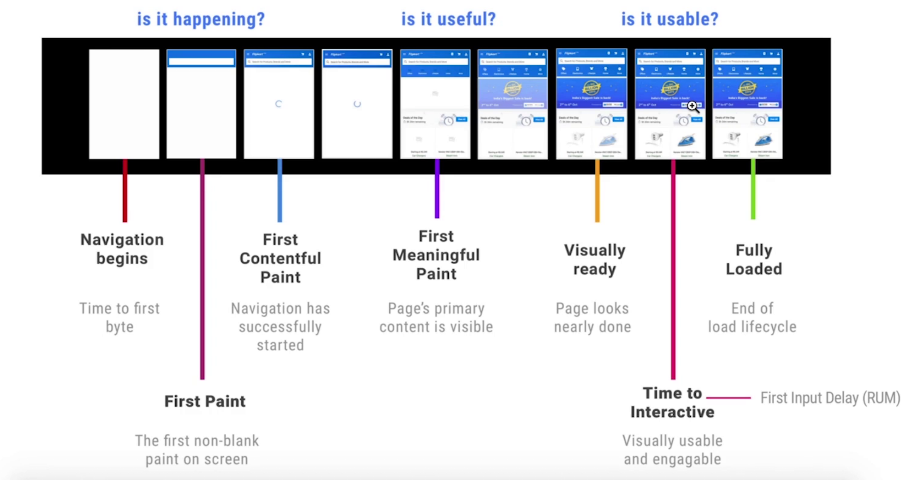

# Javascript 开销

Javascript 要经历加载、解析&编译、执行这样一个耗时的过程

优化方法：

- code spliting 代码拆分，按需加载
- Tree shaking 代码减重
- 避免长任务
- 避免行间脚本超过 1kb
- 使用 rAF 和 rIC 进行时间调度
- 渐进式启动 Progressive Bootstrapping




# 配合 V8 优化代码

- 抽象语法树

  - 源码 => 抽象语法树 => 字节码Bytecode => 机器码
  - 编译过程进行优化
  - 运行时可能发生反优化

- V8 优化机制

  - 脚本流

    如果一个脚本超过30kb，它会先进行一次解析，再把其它解析合并

  - 字节码缓存

  - 懒解析

    专门针对函数的优化，如果一个函数暂时没有使用则不解析它里面的内容，等它真正使用时再进行解析


# 函数优化

1. lazy parsing VS eager parsing

- lazy parsing 懒解析

  ```javascript
  export default () => {
  	const add = (a, b) => a + b; // 1
  	const a = 1;
  	const b = 2;
  	add(a, b); // 2
  }
  ```

  解析器在第“1”行时不会解析函数里面的内容，等到第“2”行再解析函数里的内容。

- eager parsing 饥饿解析

  ```javascript
  export default () => {
  	const add = ((a, b) => a + b); // 1 
  	const a = 1;
  	const b = 2;
  	add(a, b); // 2
  }
  ```

  通过给函数加了一对括号的方式，告诉解析器这是需要用 eager parsing 模式来解析的

2. 利用 optimize.js 进行优化