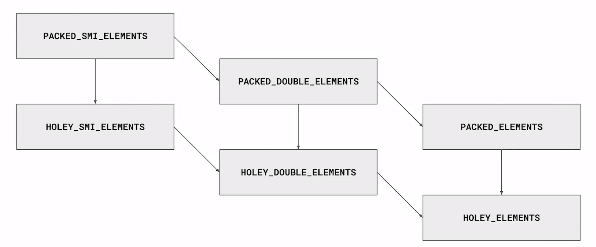

- **以相同顺序初始化对象成员，避免隐藏类的调整**

```javascript
// 优化前
// HC -> hiddenClass
const house = {area: 100}; // HC0
house.location = '成都'; // HC1

const house2 = {location: '绵阳'}; // HC3
house2.area = '80'; // HC4


// 优化后
const house = {area: 100}; // HC0
house.location = '成都'; // HC1

const house2 = {area: '80'}; // HC0 复用上面的HC0
house2.location = '绵阳'; // HC1 复用上面的HC1
```

- **实例化后尽量避免添加新属性**

  ```javascript
  const house = {area: 100}; // In-object 属性
  house.location = '成都'; // Normal/Fast 属性，它存储在 property store里，需要通过描述数组间接查找访问
  ```

- **尽量使用Array 替代array-like对象**

  ```javascript
  // 优化前
  Array.prototype.forEach.call(objArr, (value, index) => {
    console.log(value, index);
  });
  
  // 优化后
  const arr = Array.prototype.call.slice(objArr, 0);
  arr.forEach((value, index) => {
    console.log(value, index);
  });
  
  // 转化成数组的代价要小于直接遍历的代价
  ```

- **避免读取超过数组的长度**

  ```javascript
  const arr = [10, 100, 1000];
  for (let i = 0; i <= arr.length; i++ ) { // 越界比较
    if (arr[i] >= 100) {
    	console.log(arr[i]);    
    }
  }
  
  // 这里遍历的时候访问了arr[3]，造成了以下问题：
  // 1、arr 会沿原型链查找，造成性能浪费
  // 2、造成 undefined 和数字比较
  // 3、造成业务出错
  ```

- **避免元素类型转换**

  ```javascript
  const arr = [1, 2, 3]; // PACKED_SMI_ELEMENTS
  arr.push(4.4); // PACKED_DOUBLE_ELEMENTS 这时整个数组的优化发生了降级变化
  ```



更多优化关注V8官网博客：https://v8.dev/blog

